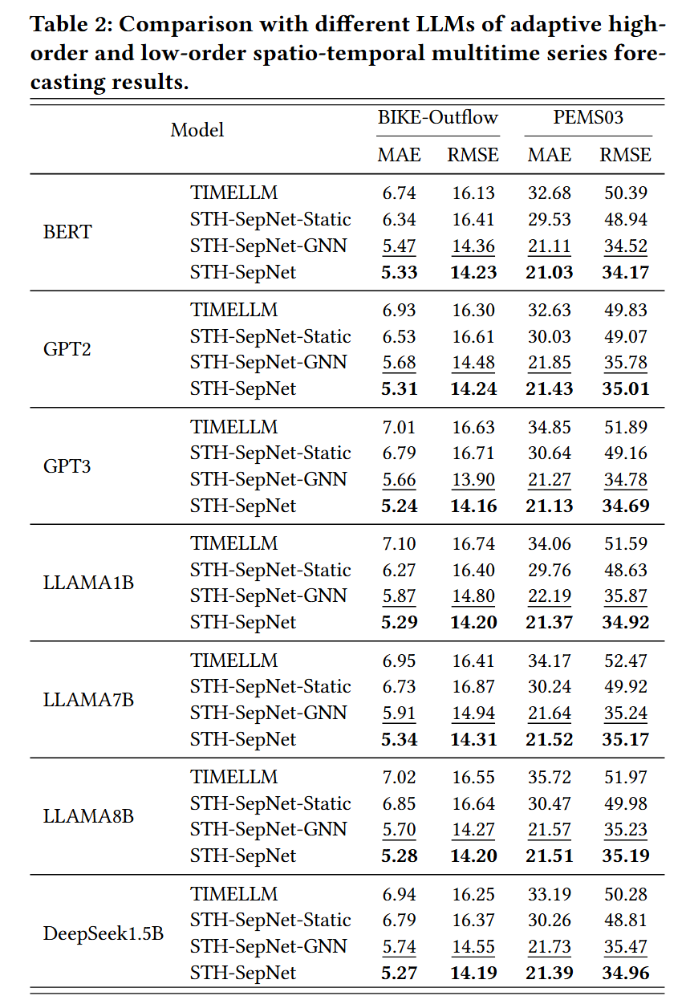
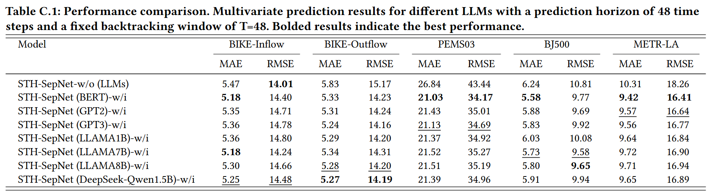

## STH-SepNet: Decoupling Spatio-Temporal Prediction: When Lightweight Large Models Meet Adaptive Hypergraphs

Welcome to STH-SepNet's GitHub repository! This repository hosts the code, data and model weight of **STH-SepNet** (KDD'25 Research Track).

**Abstract**: Spatio-temporal prediction is a pivotal task with broad applications in traffic management, climate monitoring, and energy scheduling. However, existing methodologies often struggle to balance model expressiveness and computational efficiency, especially when scaling to large real-world datasets. To tackle these challenges, we propose STH-SepNet (Spatio-Temporal Hypergraph Separation Network), a novel framework that decouples temporal and spatial modeling to enhance both efficiency and precision. Therein, the temporal dimension is modeled using lightweight large language models, which effectively capture low-rank temporal dynamics. Concurrently, the spatial dimension is addressed through an adaptive hypergraph neural network, which dynamically constructs hyperedges to model intricate, higher-order interactions. A carefully designed gating mechanism is integrated to seamlessly fuse temporal and spatial representations. By leveraging the fundamental principles of low-rank temporal dynamics and spatial interactions, STH-SepNet offers a pragmatic and scalable solution for spatio-temporal prediction in real-world applications. Extensive experiments on large-scale real-world datasets across multiple benchmarks demonstrate the effectiveness of STH-SepNet in improving predictive performance while maintaining computational efficiency. This work may provide a promising lightweight framework for spatio-temporal prediction, aiming to reduce computational demands and while enhancing predictive performance.


<p align="center">

</p>

## 1. Preparation
### 1.1 Environment 

The lightweight training requires torch 2.0+, to install all dependencies , update corresponding libraries: 
```shell
pip install -r requirements.txt
```

### 1.2 Data 
The data can be obtained and downloaded from ([Google Drive](https://drive.google.com/drive/folders/1uhQqAdrIplhhKCHn0McnB-trve6_rATD?usp=drive_link)), and makedir path ```dataset/``` and put dataset in ```dataset/```.


### 1.3 Large Language Models

The pretrained models can be downloaded from the links in the Table as below,  and makedir path ```huggingface/``` and put pretrained models in ```huggingface/```. For example, ```huggingface/BERT```


| Model 🤗 | Parameters | LLM Dimension | Model Description                                                                 |
|------------------------------------------------------------------------|------------|---------------|-----------------------------------------------------------------------------------|
| [BERT](https://huggingface.co/google-bert/bert-base-uncased)           | 110M       | 768           | A Transformer-based pre-trained model for NLP tasks, excelling in sentence classification and question answering. |
| [GPT-2](https://huggingface.co/openai-community/gpt2)                 | 124M       | 768           | A Transformer-based generative model, specialized in text generation and language modeling. |
| [GPT-3](https://huggingface.co/TurkuNLP/gpt3-finnish-large)           | 7580M      | 4096          | A large-scale Transformer-based generative model supporting various language tasks. |
| [LLAMA-1B](https://huggingface.co/meta-llama/Llama-3.2-1B)            | 1230M      | 2048          | A multilingual model developed by Meta, designed for dialogue and knowledge retrieval tasks. |
| [LLAMA-7B](https://huggingface.co/huggyllama/llama-7b)                | 6740M      | 4096          | A multilingual model developed by Meta, suitable for various natural language generation tasks. |
| [LLAMA-8B](https://huggingface.co/meta-llama/Llama-3.1-8B-Instruct)   | 8000M      | 4096          | A multilingual model developed by Meta, focused on dialogue and instruction-tuning tasks. |
| [DeepSeek-Qwen1.5B](https://huggingface.co/deepseek-ai/DeepSeek-R1-Distill-Qwen-1.5B) | 1500M      | 1536          | A reasoning-focused model enhanced through reinforcement learning for improved reasoning capabilities. |
| |


## 2. Main Results
### 2.1 Training Preparation
#### 2.1.1 Download datasets and place them under `./dataset`.
#### 2.1.2 Download pretrained models and place them under `./huggingface`.
#### 2.1.3 Complete list of parameters


| Parameter        | Type           | Description  | Default Value |
| :-------------: |:-------------:| :-------------------------------|:-------------: |
| `model`     | string | Name of the model, among:<br> - `pool`: SHT-SepNet model with adaptive hypergraphs module <br> - `Autoformer`: Decomposition Transformers with Auto-Correlation for Long-Term Series Forecasting  (NeurIPS 2021) <br>- `TIMELLM`: Time Series Forecasting by Reprogramming Large Language Models (ICLR 2024) | `pool` |
| `dataset`    | string      | Name of the dataset, among:<br> - `inflow`: Bike traffic flow inflow <br> - `outflow`: Bike traffic flow outflow   <br> - `PEMS03`: California Highway network PeMS traffic flow dataset <br> - `BJ`: Traffic dataset of road network in some areas of Beijing <br> - `METR`:Traffic sensor data in the Los Angeles area <br>  You can also specify any additional graph dataset, in *edgelist* format, by editing `data_loader.py`| `inflow`|
| `node_num`| int | the node number of the network <br> -`Inflow, Outflow: 295` <br>-`PEMS03`:358  <br> -`BJ`:500 <br>-`METR`： 207| `295` |
| `features` | string |forecasting task, options:[M, S, MS], among: <br> - `M`: multivariate predict multivariate <br> - `S`: univariate predict univariate <br> - `MS`:multivariate predict univariate <br>  | `M` |
| `llm_model`|  string  | LLM model: `BERT，GPT2，GPT3，LLAMA1b，LLAMA7b,LLAMA8b, deepseek2b ` | `BERT` |
| `static`                | bool   | Whether to use static adjacency matrix module        | `False`       |
| `gcn_true`              | bool   | Whether to use GCN module                             | `True`       |
| `adaptive_hyperhgnn`    |  string   | Hypergraph neuron network: hgcn, hgat, hsage          | `'hgcn'`      |
| `hgcn_true`             | bool   | Whether to use HGCN module                            | `True`       |
| `temporal_true`          | bool   | Whether to use Temporal convolutional networks Module | `True`       |
| `fusion_gate`| string | Style of module fusion: <br>- `adaptive`:Fusion of LLMs time module and adaptive hypergraph module features，<br>-`hyperstgnn `:Only the adaptive hypergraph module features are retained | `adaptive` |
| `llm_dim`| int | LLM model dimension <br> - `BERT, GPT2`: 768 <br> -`LLAMA7b,LLAMA8b,GPT3`: 4096 <br> - `LLAMA1b`: 2048  <br> - `deepseek2b`:1536  <br>   | `768` |
| `seq_len`| int | input sequence length | `48` |
| `label_len`| int | start token length | `48` |
| `pred_len`| int | prediction sequence length | `48` |
| `enc_in`| int | encoder input size (e.g, Node num) | `295` |
| `dec_in`| int | decoder input size (e.g, Node num) | `295` |
| `c_out`| int | output size (e.g, Node num) | `295`  |
| `d_model`| int | dimension of model | `32` |
| `n_heads`| int | num of heads | `16` |
| `e_layers`| int | num of encoder layers | `2` |
| `d_layers`| int | num of decoder layers | `1` |
| `d_ff`| int | dimension of fcn | `32` |
| `llm_layers`| int | num of llm layer  | `6` |
| `train_epochs`          | int    | Number of training epochs                             | `50`          |
| `align_epochs`          | int    | Number of alignment epochs                            | `10`          |
| `alpha`                 | float  | Adjustable parameter to control hyperSTLLM or STLLM  | `0.1`         |
| `beta`                  | float  | Adjustable parameter to control hyperSTLLM or STLLM  | `0.2`         |
| `gamma`                 | float  | Adjustable parameter to control hyperSTLLM or STLLM  | `0.5`         |
| `theta`                 | float  | Adjustable parameter to control hyperSTLLM or STLLM  | `0.2`         |
| |


### 2.2 Training STH-SepNet
Run scripts for demonstration purpose under the folder `./scripts`. For example, to evaluate on BIKE datasets by:

```shell
sh ./scripts/BIKE/BERT_Bike_order.sh
sh ./scripts/BIKE/GPT2_Bike_order.sh
sh ./scripts/BIKE/GPT3_Bike_order.sh
sh ./scripts/BIKE/LLAMA1B_Bike_order.sh
sh ./scripts/BIKE/LLAMA7B_Bike_order.sh
sh ./scripts/BIKE/LLAMA8B_Bike_order.sh
sh ./scripts/BIKE/Deepseek_Bike_order.sh
```

### 2.3 Training STH-SepNet-GNN
Run scripts for demonstration purpose under the folder `./scripts`. For example, to evaluate on BIKE datasets by:

```shell
sh ./scripts/BIKE/BERT_Bike.sh
sh ./scripts/BIKE/GPT2_Bike.sh
sh ./scripts/BIKE/GPT3_Bike.sh
sh ./scripts/BIKE/LLAMA1B_Bike.sh
sh ./scripts/BIKE/LLAMA7B_Bike.sh
sh ./scripts/BIKE/LLAMA8B_Bike.sh
sh ./scripts/BIKE/Deepseek_Bike.sh
```


### 3. Ablation Study
### 3.1 STH-SepNet-without LLMs (w/o) 
For example, to evaluate on BIKE datasets by:

```shell
model_name=pool
train_epochs=50
learning_rate=0.0005
llama_layers=32
master_port=0
num_process=2
batch_size=16
d_model=768
d_ff=32
comment='BERT-Bike'
accelerate launch   --mixed_precision bf16  --dynamo_backend 'no' --num_processes $num_process  run_main.py \
  --task_name long_term_forecast \
  --is_training 1 \
  --root_path ./dataset/Bike/ \
  --data_path inflow.csv \
  --model_id BIKE_48_48 \
  --model $model_name \
  --data inflow \
  --features M \
  --seq_len 48 \
  --label_len 48 \
  --pred_len 48 \
  --factor 3 \
  --des 'Exp' \
  --itr 1 \
  --d_model $d_model \
  --d_ff $d_ff \
  --batch_size $batch_size \
  --learning_rate $learning_rate \
  --llm_model 'BERT' \
  --llm_dim 768 \
  --llm_layers $llama_layers \
  --train_epochs $train_epochs \
  --model_comment $comment \
  --gamma  0.0   \
  --fusion_gate  'hyperstgnn' \
  --enc_in    $node_num  \
  --dec_in   $node_num  \
  --c_out  $node_num  \
  --scale_hyperedges 3 \
  >>./result//BERT_BIKEIN_48_48_hypergnn_order3.txt

```

### 3.2 STH-SepNet-Mixorder 
Run scripts for demonstration purpose under the folder `./scripts`. For example, to evaluate on BIKE datasets by:

```shell
sh ./scripts/BIKE/BERT_Bike_mixorder3.sh
sh ./scripts/BIKE/GPT2_Bike_mixorder3.sh
sh ./scripts/BIKE/GPT3_Bike_mixorder3.sh
sh ./scripts/BIKE/LLAMA1B_Bike_mixorder3.sh
sh ./scripts/BIKE/LLAMA7B_Bike_mixorder3.sh
sh ./scripts/BIKE/LLAMA8B_Bike_mixorder3.sh
sh ./scripts/BIKE/Deepseek_Bike_mixorder3.sh
```


### 3.3 STH-SepNet-Effective Order on Adaptive Hypergraph
Run scripts for demonstration purpose under the folder `./scripts`. For example, to evaluate on BIKE datasets by:

```shell
sh ./scripts/BIKE/BERT_Bike_Outflow_flexible_order3.sh
sh ./scripts/PEMS/BERT_PEMS03_flexible_order.sh
```


## 4. Performance and Visualization

<p align="center">

</p>

<p align="center">

</p>


<p align="center">

</p>


## 5.Further Reading 
### Our research baselines models refer to the following works and their repository code.


STG4Traffic: {A} Survey and Benchmark of Spatial-Temporal Graph Neural Networks for Traffic Prediction. [[Paper]](https://arxiv.org/abs/2307.00495)[[Code]](https://github.com/trainingl/STG4Traffic?utm_source=catalyzex.com).
```tex
@article{DBLP:journals/corr/abs-2307-00495,
  author       = {Xunlian Luo and Chunjiang Zhu and Detian Zhang and Qing Li},
  title        = {STG4Traffic: {A} Survey and Benchmark of Spatial-Temporal Graph Neural
                  Networks for Traffic Prediction},
  journal      = {CoRR},
  volume       = {abs/2307.00495},
  year         = {2023}
}
```

Deep Time Series Models: A Comprehensive Survey and Benchmark. [[Paper]](https://arxiv.org/abs/2407.13278)[[Code]](https://github.com/thuml/Time-Series-Library).
```tex
@article{wang2024tssurvey,
  title={Deep Time Series Models: A Comprehensive Survey and Benchmark},
  author={Yuxuan Wang and Haixu Wu and Jiaxiang Dong and Yong Liu and Mingsheng Long and Jianmin Wang},
  booktitle={arXiv preprint arXiv:2407.13278},
  year={2024},
}

```
